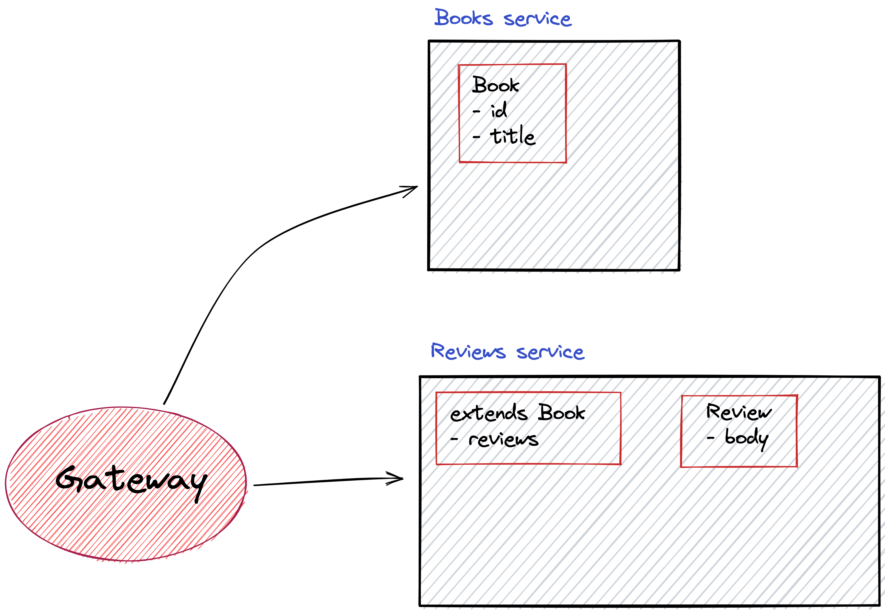

# Strawberry Apollo Federation demo

This repo contains a demo of Strawberry's Apollo Federation support.

It contains 3 services:

1. A `books` service
2. A `reviews` service
3. A `gateway` service

## Books

The books service provides a GraphQL API that returns a list of books.

## Reviews

The reviews service provides a GraphQL API that only extends the `Book` type
(coming from the `books` service) with a `reviews` field.

The `reviews` field is a list of reviews for the book.

## Gateway

The gateway service provides a GraphQL API that combines the `books` and
`reviews`. It is implemented with Apollo Server and Apollo Gateway.

## Schema



# Running the demo

For convenience we provided a docker-compose file that can be used to run the
whole demo.

Assuming you have docker and docker compose installed you can run the following
command to start the demo:

```bash
docker-compose up
```

This should start all the services and you should be able to access the GraphQL
API at `http://localhost:7000/graphql`.
